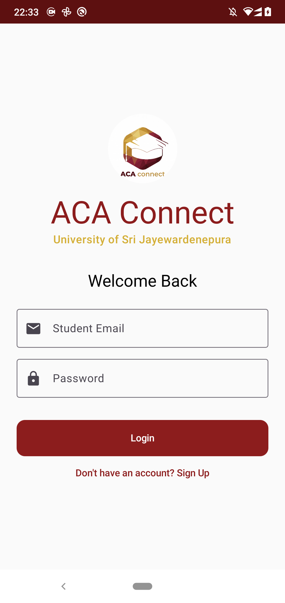
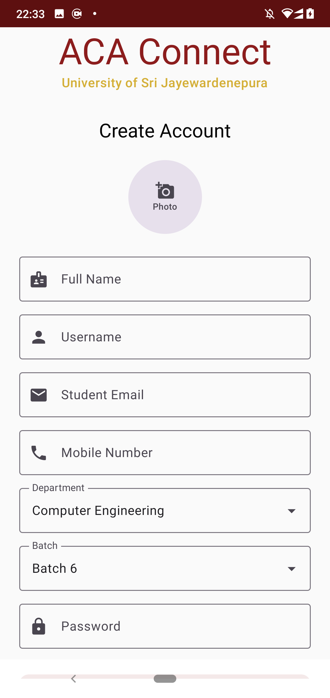
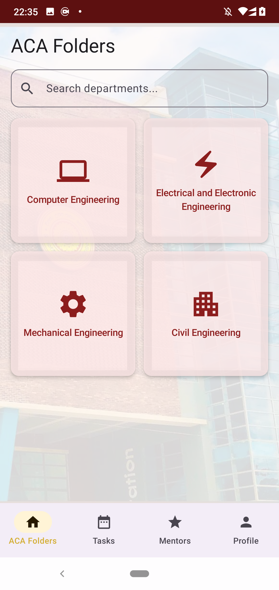
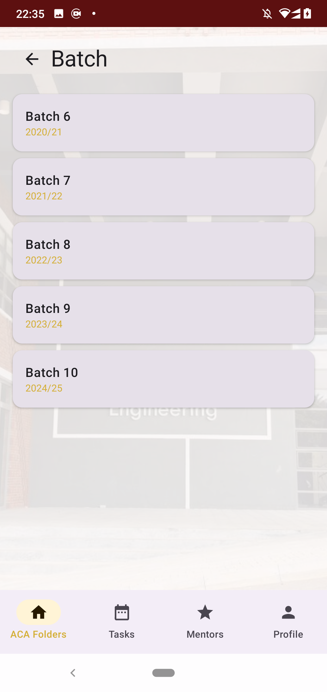
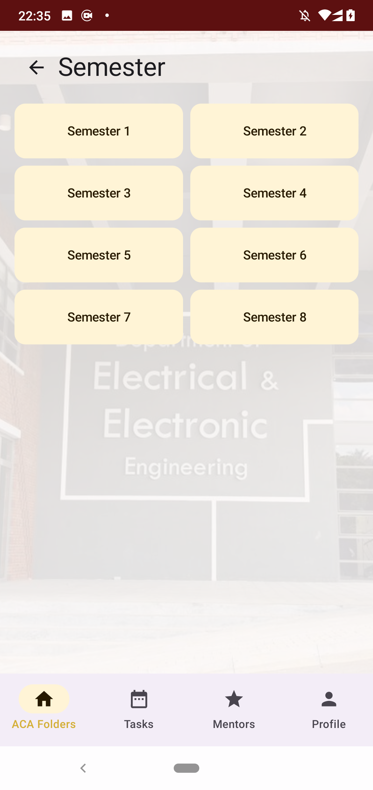
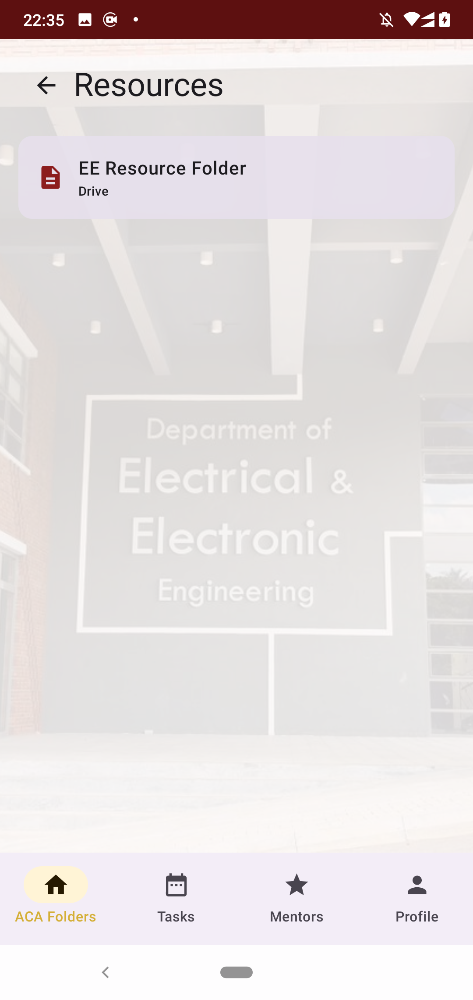
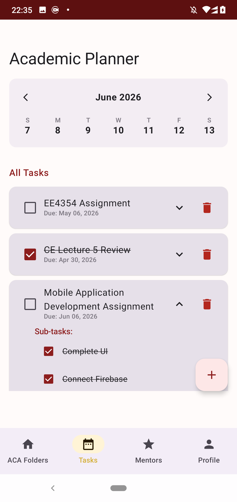
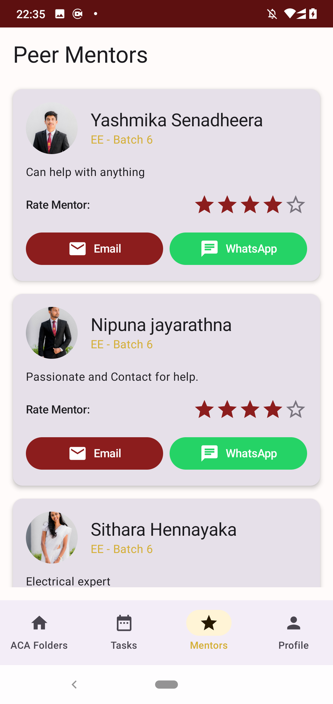
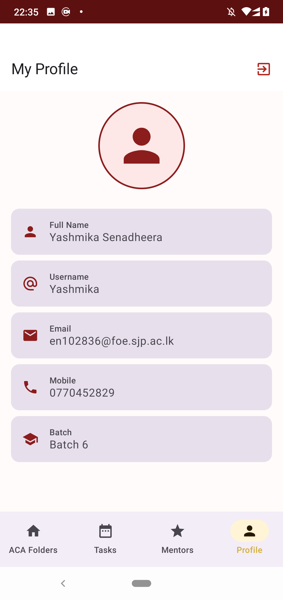

# ACA Connect - Academic Support & Collaboration App

**ACA Connect** is a specialized Android application designed for the Faculty of Engineering at the University of Sri Jayewardenepura (SJP). It serves as a centralized hub for academic resources, peer mentorship, and student task management.

## 🚀 Key Features

- **Centralized Academic Folders**: Access department-specific (Computer, Electrical, Mechanical, Civil) and semester-wise Google Drive resources (slides, notes, recordings) in one place.
- **Dynamic Contextual UI**: Experience a customized interface that changes its background and branding based on your selected department (e.g., specific SJP Engineering building backgrounds).
- **Peer Mentorship System**: Connect with senior mentors from batches 6-10. Features one-tap contact via WhatsApp/Email and an interactive 5-star rating system.
- **Student Task Planner**: Stay organized with a dedicated task manager supporting sub-tasks and deadline tracking.
- **Secure Authentication**: User accounts powered by Firebase, including profile picture uploads and student metadata synchronization.
- **SJP Branding**: Thematically aligned with the official University maroon and gold palette.

## 🛠️ Built With

- **Kotlin**: Primary programming language.
- **Jetpack Compose**: Modern declarative UI framework.
- **Firebase Auth**: User authentication.
- **Cloud Firestore**: Real-time NoSQL database for user profiles and mentor data.
- **Firebase Storage**: For storing student profile pictures.
- **Coil**: Image loading library for Compose.
- **Material 3**: Google's latest design system.

## 📸 Screenshots

<p align="center">
  
  
  
</p>
<p align="center">
  
  
  
</p>
<p align="center">
  
  
  
</p>

## 📥 Setup and Installation

1. **Clone the repository**:
   ```bash
   git clone https://github.com/YOUR_USERNAME/ACA-Connect.git
   ```
2. **Open in Android Studio**:
   - File > Open > Select the cloned folder.
3. **Connect to Firebase**:
   - Create a project on the [Firebase Console](https://console.firebase.google.com/).
   - Add an Android app with package name `com.example.acaconnect`.
   - Download the `google-services.json` and place it in the `app/` directory.
   - Enable **Authentication** (Email/Password), **Firestore**, and **Storage**.
4. **Sync Project with Gradle Files** and Run.

## 📄 License

This project was developed for the **EE4353: Mobile Application Development** course at the University of Sri Jayewardenepura.

---
Developed by [Your Name]
